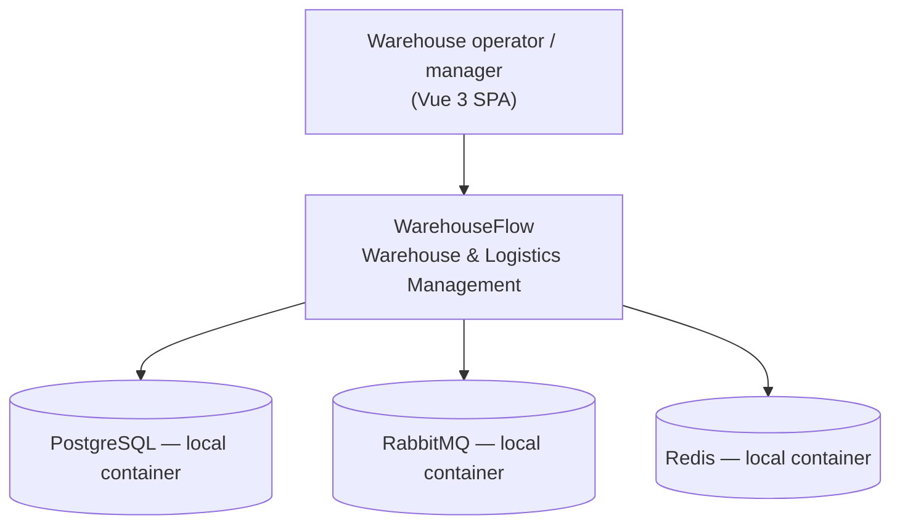
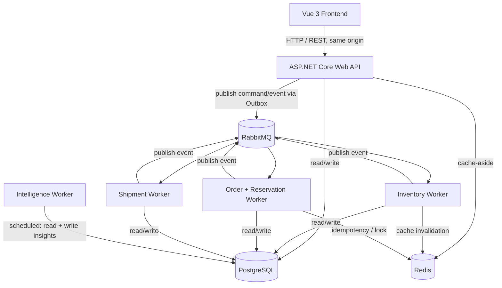

# Architecture

WarehouseFlow is a **modular monolith on the write side, event-driven across workers**: one API
process accepts work synchronously; three .NET Worker Services consume it from RabbitMQ (13
MassTransit consumers between them) and a fourth runs scheduled intelligence analysis. PostgreSQL
is the single source of truth; Redis is a cache and a best-effort lock, never authoritative.

## System context

No cloud service, mail server, SMS provider, map/GPS provider, payment provider, external API, or
third-party logistics service appears here, because the system has none.

## Containers

## Backend projects

| Project | Role |
|---|---|
| `WarehouseFlow.Domain` | Entities, value objects, aggregate invariants. No infrastructure dependencies. |
| `WarehouseFlow.Contracts` | Versioned command / event records (`V1`). The single source of message shapes. |
| `WarehouseFlow.Persistence` | EF Core `DbContext`, entity configurations, 58 migrations, query + write services. |
| `WarehouseFlow.Messaging` | Transactional Outbox tables, the polling `OutboxBatchProcessor`, `ProcessedMessage` (Inbox) infrastructure, MassTransit wiring. |
| `WarehouseFlow.Caching` | `IWarehouseFlowCache` (cache-aside), `IDistributedLock` (best-effort Redis lock), key builders, TTL policy. |
| `WarehouseFlow.Intelligence` | Observe → analyze → score → detect → persist. Never mutates operational state (INV-002). |
| `WarehouseFlow.Api` | HTTP surface: 45 controllers, policy-based authZ, warehouse scoping, validation, health checks, OpenAPI. |
| `WarehouseFlow.InventoryWorker` | `ReceiveStock` / `AdjustStock` / `TransferStock` consumers; emits `StockLowDetected`. |
| `WarehouseFlow.OrderReservationWorker` | `ReserveStock` consumer — the concurrency-critical path. |
| `WarehouseFlow.ShipmentWorker` | `CreatePickingTask`, complete-picking, create-package, dispatch-shipment consumers. |
| `WarehouseFlow.IntelligenceWorker` | Scheduled analysis runner for the intelligence / forecasting / automation layers. |

## Synchronous vs asynchronous

| Synchronous (HTTP, immediate result) | Asynchronous (command → RabbitMQ → worker → event) |
|---|---|
| Product / warehouse / location CRUD | Stock receive / adjust / transfer |
| All reads (stock, orders, picking, packages, shipments) | Stock reservation |
| Order **acceptance** (`Order` created `PendingReservation`) | Picking task creation, completion |
| Admin / user / role management | Packing, shipment status transitions |

An order is accepted synchronously (`201 Created`, status `PendingReservation`); the actual
reservation is processed by a worker and its outcome published as an event. The frontend polls
`GET /api/orders/{id}` for the resolved status (`Reserved` / `ReservationFailed`). Polling stops on
a terminal state, is attempt-bounded, and aborts immediately on `AbortSignal`.

## Data ownership

Write responsibility follows the workflow, not a per-service database. The API writes synchronous
management and review changes; workers write the command-driven stock / reservation / picking /
package / shipment transitions. Cross-domain consumers that need the quantity chain (short-pick
release, dispatch) update the relevant stock and operation rows together in one
`WarehouseFlowDbContext` transaction. On the read side, any component may read any table directly —
there is one database.

## Failure modes

| Dependency down | Behaviour |
|---|---|
| **RabbitMQ** | API keeps writing to the Outbox table. A background publisher drains it when the broker returns. Domain updates are delayed; nothing is lost. |
| **Redis** | System enters *degraded* mode: cache is bypassed (reads go straight to PostgreSQL), idempotency falls back to the `processed_messages` table. Still fully correct, just slower. |
| **PostgreSQL** | API and workers report *unhealthy*; requests return `503`; workers stop their consumers and retry the connection. |

Detail per subsystem lives in the private repo's `docs/08-rabbitmq-design.md`,
`docs/09-redis-design.md`, and `docs/14-error-handling-and-resilience.md`.

## Deployment model

Everything comes up on one Docker Compose network with `docker compose up`. There is no hosted
instance and no cloud dependency anywhere in the architecture. With images pre-pulled the stack
runs with no internet connection.
