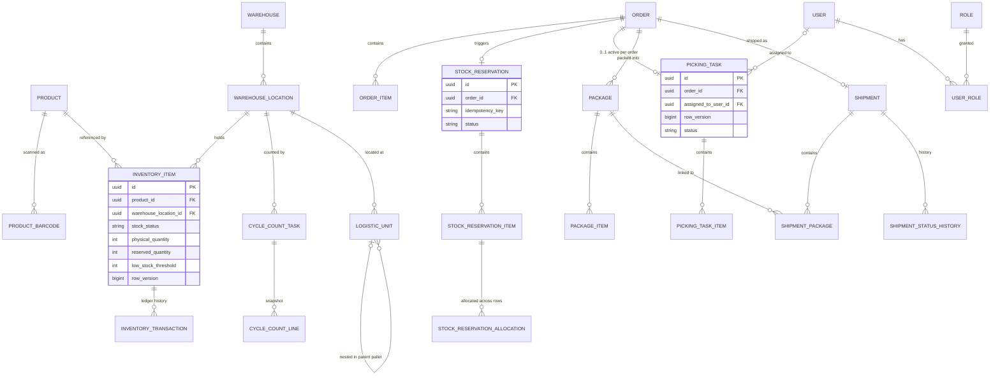
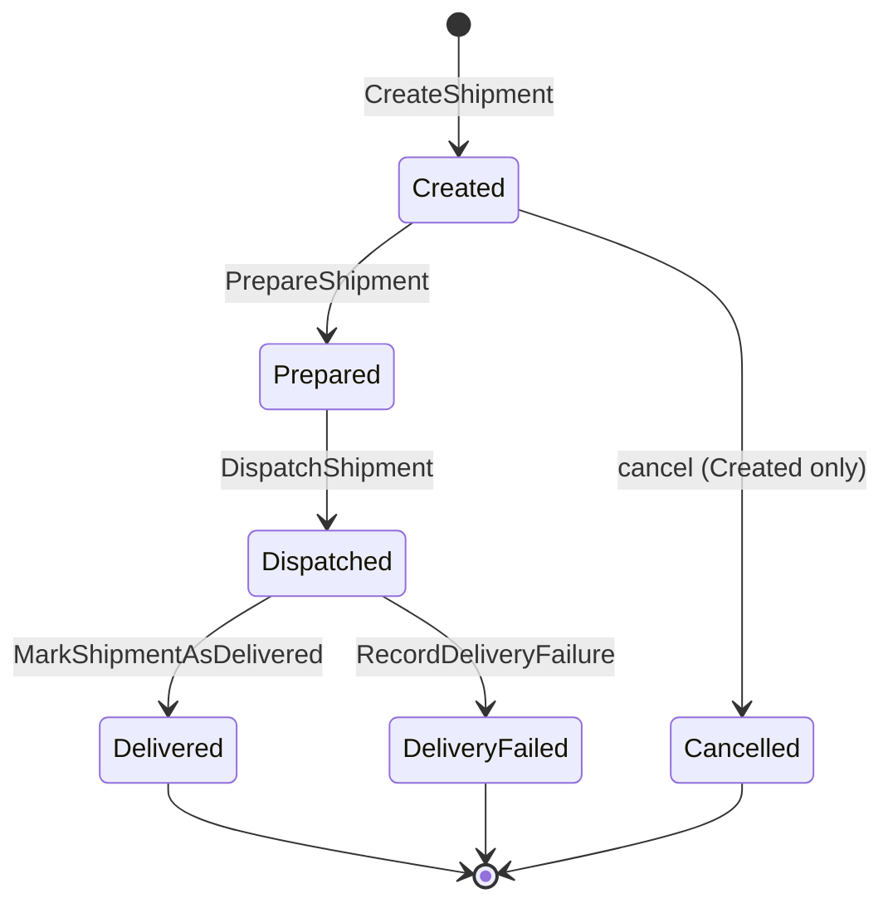

# Domain model

## Entity relationships (core)

`Notification`, `Courier`, `Route`, `MapLocation`, `GeoCoordinate`, `TrackingPoint`, and
`ExternalIntegration` do not exist — the system has no such concerns.

## The three quantities

| Quantity | Meaning |
|---|---|
| **Physical** | Units actually on the shelf at a location |
| **Reserved** | Units committed to an order but not yet dispatched |
| **Available** | `Physical − Reserved` — what a new reservation can draw on |

These are kept distinct at every layer, and the database enforces
`0 ≤ reserved ≤ physical` with check constraints.

## Shipment state machine

Only a `Created` shipment can be cancelled — `Prepared` / `Dispatched` are refused because of
physical hand-off risk. Cancellation frees the package links for reuse, clears staging, and writes
status history with actor + reason.

## Domain aggregates (Domain project namespaces)

`Automation` · `Configuration` · `Copilot` · `Forecasting` · `Identity` · `Inventory` · `Labor` ·
`Logistics` · `Operations` · `Orders` · `Packaging` · `Picking` · `Planning` · `Products` ·
`Putaway` · `Receiving` · `Replenishment` · `Reservations` · `Returns` · `Routing` · `Shipments` ·
`Transfers` · `Warehouses`

## Invariants

Rules that hold across every phase. New work references these by ID instead of restating them.

| ID | Invariant |
|----|-----------|
| INV-001 | The PostgreSQL transactional domain is the **sole** source of operational truth. No other layer (Intelligence, Simulator, Optimization, AI) may become source of truth. |
| INV-002 | Warehouse Intelligence only observes → analyzes → scores → detects → persists. It never mutates inventory, reservations, or shipments, and never issues operational commands. |
| INV-003 | The Simulator executes all warehouse operations through the **real** API / application command paths. It never `INSERT`/`UPDATE`s operational tables directly. |
| INV-004 | The Simulator keeps an independent Physical Twin. Reconciliation reports diffs; it never forces the database to match the twin. |
| INV-005 | Optimization output (slotting, routing, waves) is a **recommendation**. Any resulting movement executes through existing domain commands, respecting existing rules (capacity, storage-class, blocked-location, FEFO). |
| INV-006 | AI/LLM components never produce operational truth and never bypass domain commands. Factual claims must be grounded in verified evidence, not invented. |
| INV-007 | State-mutating automated/AI actions require human approval, tiered by risk (read/explain → automatic; recommendation/draft → automatic; inventory mutation → human approval; dispatch/cancellation → explicit privileged approval). |
| INV-008 | Existing concurrency, idempotency, ledger, transaction, and reliability guarantees must not be weakened by any new phase. |
| INV-009 | Anomaly detectors combine a minimum sample-size guard with an absolute-value threshold *in addition to* any ratio threshold — no false positives on small samples. |
| INV-010 | Every insight, health score, and recommendation carries structured, persisted evidence sufficient to explain "why" without fabrication. |
| INV-011 | Insight lifecycle is stateful (`Active → Acknowledged/Resolved → Reopened`), not append-only — a recurring problem updates one record. |
| INV-012 | Given the same `(seed, config, scenario, initial state, app version)`, the Simulator reproduces the same event sequence. |
| INV-013 | Every simulation event and offline-client command carries an idempotency key; retries never duplicate the business operation. |
| INV-014 | Redis (or any cache) is never the source of truth — cache only, bounded TTL. |
| INV-015 | Forecast models receive only the operational history WarehouseFlow actually recorded — never the Simulator's internal demand formula (no train/test leakage). |
| INV-016 | Simulator-generated conditions never directly create the expected Intelligence/AI result; the downstream layer must independently derive it. |
