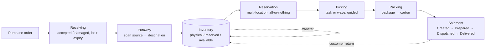
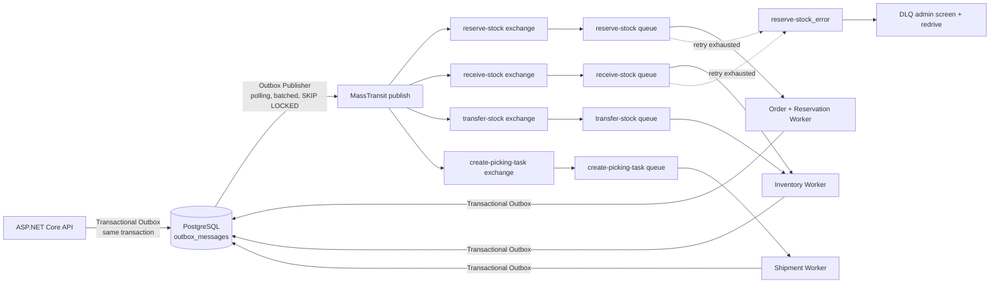
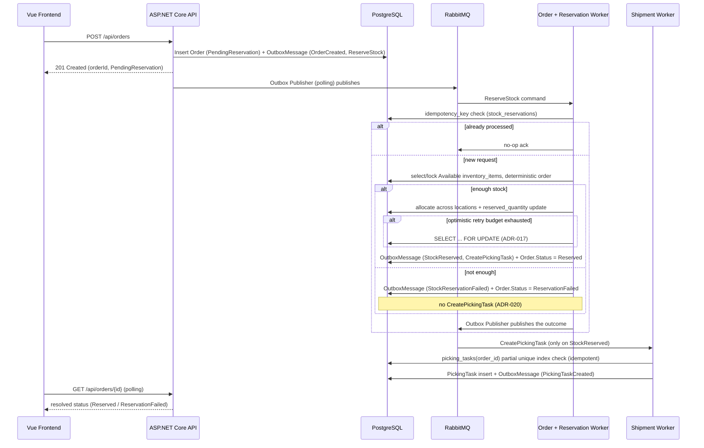
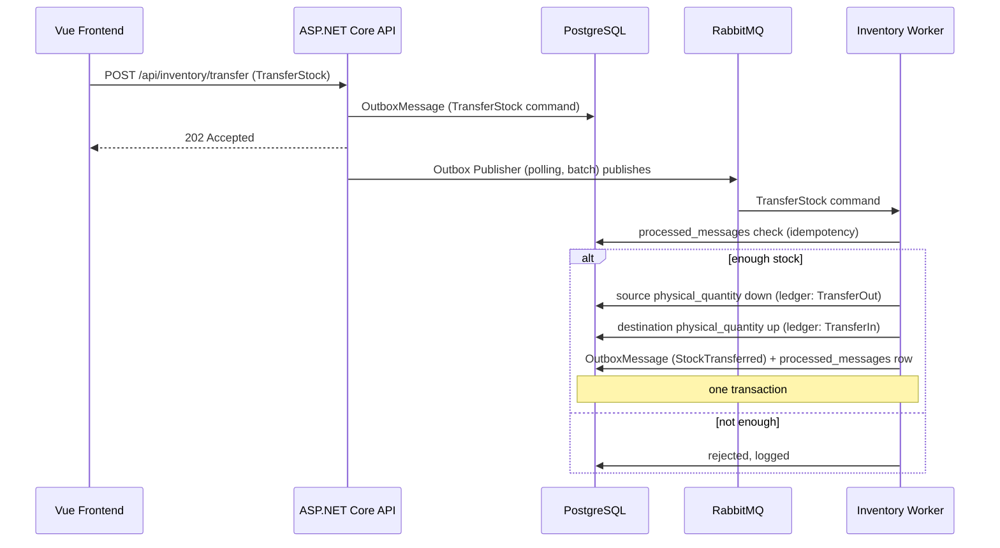
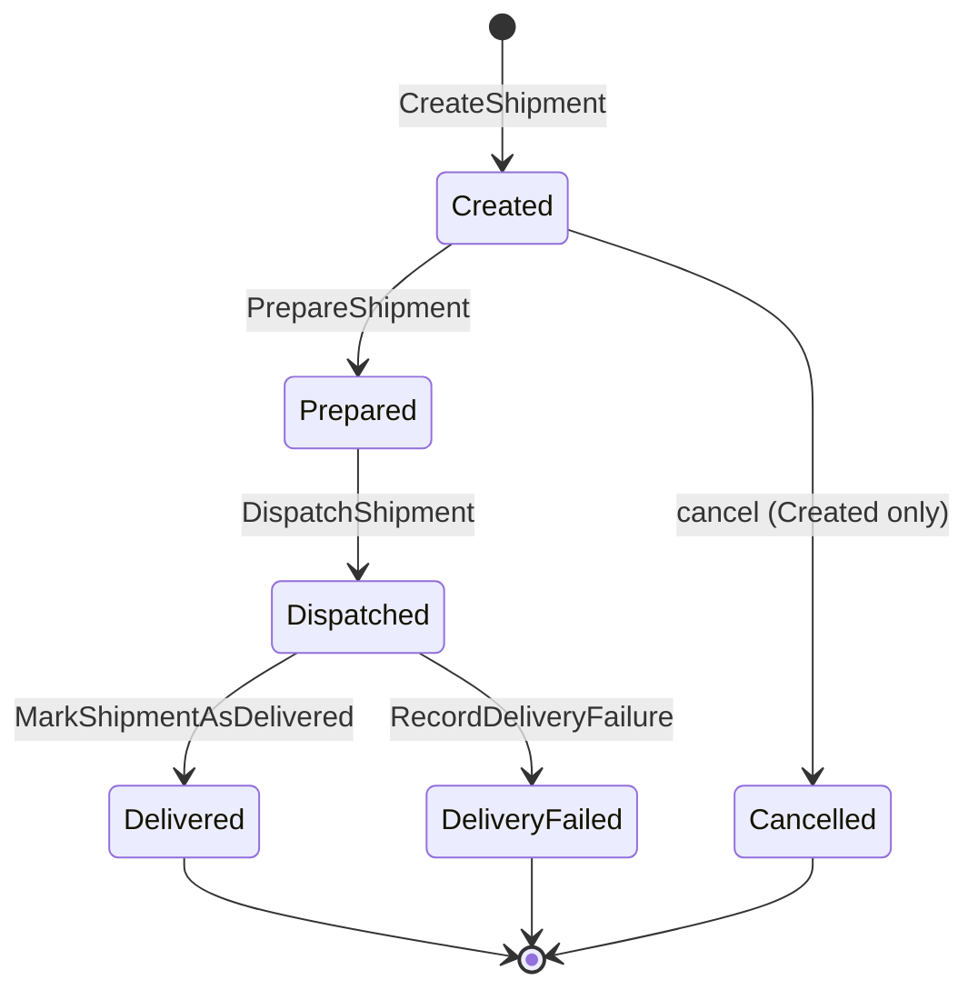
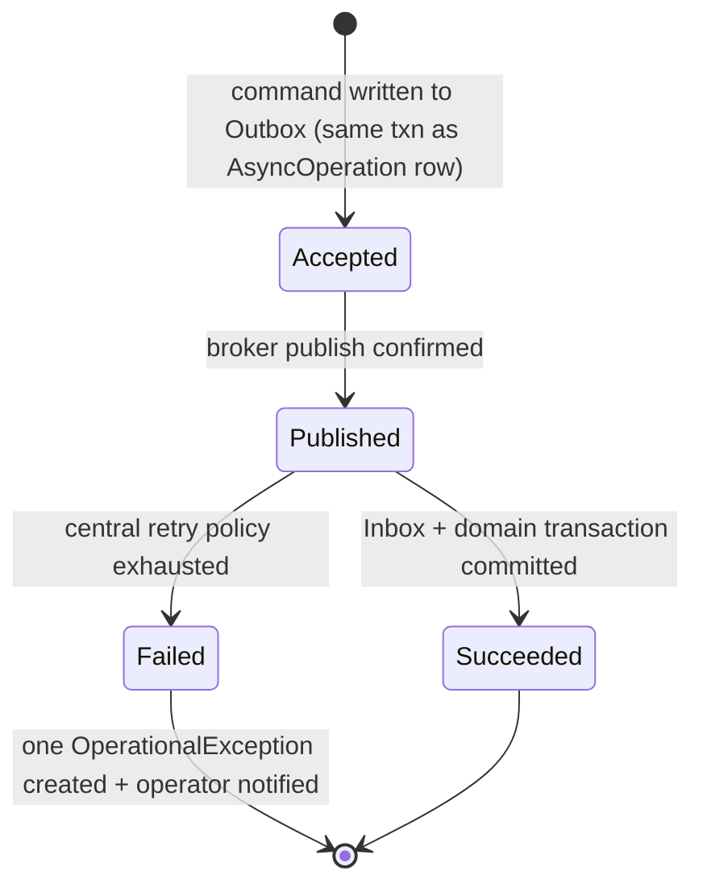

# Visual walkthrough

A guided tour of the goods flow and the messaging that drives it.

> Live UI screenshots will be added here later. Everything below is generated from the project's
> own design diagrams.

## The goods flow

Every arrow that changes stock goes through the append-only ledger and is attributed to the
initiating operator.

## How a stock command travels

The API never publishes directly. It writes the message to `outbox_messages` in the same
transaction as the domain change; a polling publisher drains the table to RabbitMQ and only then
marks the row processed. See [reliability.md](reliability.md#1-the-dual-write-problem--transactional-outbox).

## Order → reservation → picking

## Stock transfer (single transaction, both sides)

## Shipment state machine

At dispatch, physical **and** reserved quantities are decremented atomically, and the ledger
records a `ShipmentDispatch` movement referencing the order. Only a `Created` shipment can be
cancelled — later stages carry physical hand-off risk.

## Async operation lifecycle

`202 Accepted` only proves the request reached the Outbox — this lifecycle makes the real outcome
of background work visible. See [reliability.md](reliability.md#5-failures-that-must-not-vanish--durable-async-lifecycle--dlq).
